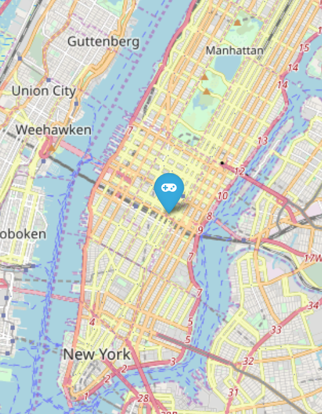

# Best location for a video games company in NYC

The aim of this project is to decide the best location for a video games company office taking into account the requisites of bellow.  

## Requisites

You recently created a new company in the `GAMING industry`. You have to found a place in New York, that more or less covers all the following requirements:  

- Designers like to go to design talks and share knowledge. There must be some nearby companies that also do design.  
- 30% of the company have at least 1 child.  
- Executives like Starbucks A LOT. Ensure there's a starbucks not to far.  
- All people in the company have between 25 and 40 years, give them some place to go to party.  
- Nobody in the company likes to have companies with more than 10 years in a radius of 2 KM.  
- The CEO is Vegan

## Process

In order to know the location for the videogames companies of New York city and all the companies older than 10 years old I used the Techcrunch dataset.  

About Starbucks. Kindergartens. CLubs and Vegans I performed the requests to the Gmaps API and then I stored this information in geojsons.  

Once all the needed coordinates were collected I created a collection in MongoDB for cleaning the outliers and for getting the best spot fo this office. Finally, for representing the possible spots I used folium library.    

## Result

This is the best location (40.730610,-73.935242) in New York city for the new office:

## Files included

- Google API.ipynb -> coordinates of kindergartens, clubs, vegan food and Starbucks in New York.  
- PyMongo.ipynb -> coordinates of the offices.  
- Main.ipynb ->  map showing all the coordinates and the   final location for the new office.
- requirements.txt -> modules required to run the program
- src -> contains the auxilar functions
- input -> zip containing the offices info
​
## Contact info

If you have any doubt please don't heisitate to contact with me:

- email : jgph91@gmail.com
- linkedin:  <a href="https://www.linkedin.com/in/javier-gomez-del-pulgar/?locale=en_US">Javier Gómez del Pulgar</a>